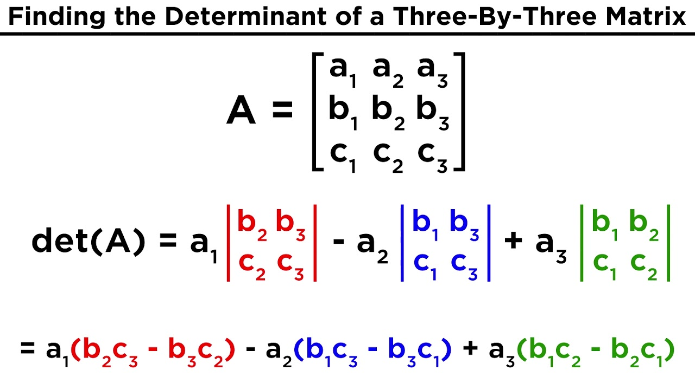
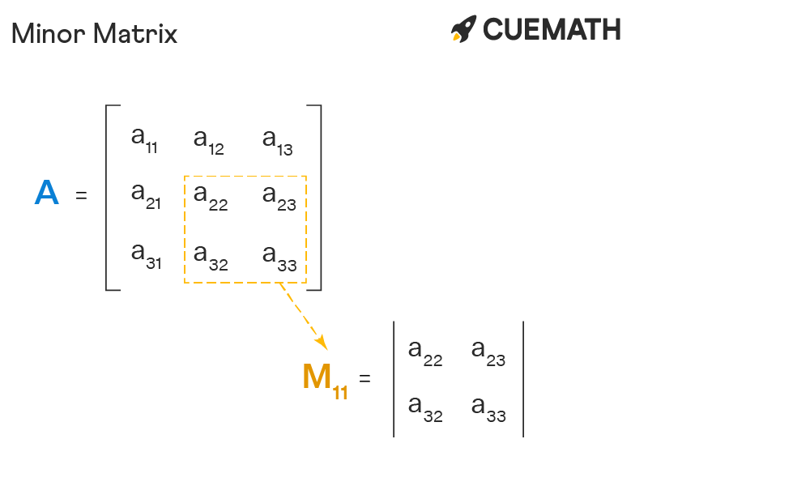

# **Advanced Linear Algebra**

### **Learning Objectives**


* What is a determinant? How would you calculate it?
* What is a minor, cofactor, adjugate? How would calculate them?
* What is an inverse? How would you calculate it?
* What are eigenvalues and eigenvectors? How would you calculate them?
* What is definiteness of a matrix? How would you determine a matrix’s definiteness?


## **Determinant**



## **Minor Matrix**

The minor of matrix is for each element of matrix and is equal to the part of the matrix remaining after excluding the row and the column containing that particular element. The new matrix formed with the minors of each element of the given matrix is called the minor of matrix.

The minor of matrix is prominently used in finding its determinant, adjoint, and inverse of a matrix.

```
matrix.A = | a11 a12 a13 |
           | a21 a22 a23 |
		   | a31 a32 a33 |
```


We can take the minors of the matrix and form a minor matrix M of the given matrix A as:

```
M = | M11 M12 M13 |
    | M21 M22 M23 |
	| M31 M32 M33 |
```

**How to Find Minor of Matrix?**

There are three simple steps to find the minor of the matrix.

* First identity and exclude the row and the column which contains the particular element within the matrix.
* As a second step, form a new smaller matrix with the remaining elements, to represent the minor of the particular element of the matrix.
* Finally, find the determinant of the minor of each element of the matrix, and form a new matrix containing the minor values of the respective elements.

## **Cofactor Matrix**
**How to find the cofactor matrix?**

Suppose A is an n × n matrix with real or complex entries. To find the cofactor matrix of A, follow these steps:

* Cross out the i-th row and the j-th column of A. You obtain a (n - 1) × (n - 1) submatrix of A.

* Compute the determinant of this submatrix. You have found the (i, j)-minor of A.

* Determine the sign factor (-1)^i+j.

* Multiply the (i, j)-minor of A by the sign factor. The result is exactly the (i, j)-cofactor of A!

* Repeat Steps 1-4 for all i,j = 1,...,n.

## **Adjugate Matrix**

the `adjugate matrix` is just the transpose of the `cofactor matrix` of A.

***Holberton School Projects (Project-based learning Machine learning)***