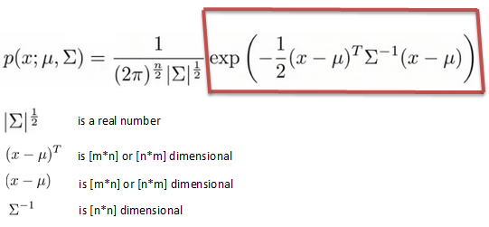

# **Multivariate Probability**

### **Learning Objectives**

* Who is Carl Friedrich Gauss?
* What is a joint/multivariate distribution?
* What is a covariance?
* What is a correlation coefficient?
* What is a covariance matrix?
* What is a multivariate Gaussian distribution?


## Joint Probability Distributions

A joint probability distribution shows a probability distribution for two (or more) random variables. Instead of events being labeled A and B, the norm is to use X and Y.

f(x, y) = P(X = x, Y = y)

* Joint Probability Mass Function
If your variables are discrete (like in the above table example), their distribution can be described by a joint probability mass function (Joint PMF). Basically, if you have found all probabilities for all possible combinations of X and Y, then you have created a joint PMF.
* Joint Probability Density Function
If you have continuous variables, they can be described with a probability density function (PDF). Unlike the discrete variable example above, you can’t write out every combination of every variable because you would have infinite possibilities to write out (which is, of course, impossible). What you can do is create a formula; The formula that describes all possible combinations of X and Y is called a joint PDF.

[more informations](https://www.statisticshowto.com/joint-probability-distribution/)

## Multivariate Gaussian distributions

* **Gaussian distributions:**

	Gaussian distribution (also known as normal distribution) is a bell-shaped curve, and it is assumed that during any measurement values will follow a normal distribution with an equal number of measurements above and below the mean value.

	The normal distribution is the most common distribution function for independent, randomly generated variables. Its familiar bell-shaped curve is ubiquitous in statistical reports, from survey analysis and quality control to resource allocation.


* **Multivariate Gaussian distributions:**

	This is simply the extension to vector-valued random variables.
	In probability theory and statistics, the multivariate normal distribution, multivariate Gaussian distribution, or joint normal distribution is a generalization of the one-dimensional (univariate) normal distribution to higher dimensions.




### **0. Mean and Covariance:**

* Mean:
[numpy.mean](https://numpy.org/doc/stable/reference/generated/numpy.mean.html)

* Covariance matrix:


*for Task 0, (file: 0-mean_cov.py) cov(X, X)!!*

```
cov_X_X = np.dot((X - mean).T, (X - mean)) / n - 1
```

### **1. Correlation :**


### **Multivariate Normal distribution Python Class**


***Holberton School Projects (Project-based learning Machine learning)***