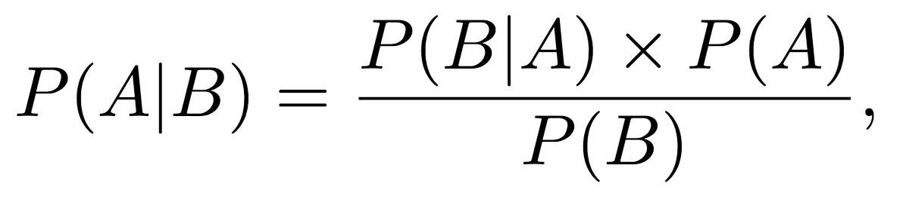

# **Bayesian Probability**

### **Learning Objectives**

* What is Bayesian Probability?
* What is Bayes’ rule and how do you use it?
* What is a base rate?
* What is a prior?
* What is a posterior?
* What is a likelihood?

## **Probability and Likelihood**

Probability attaches to possible results; likelihood attaches to hypotheses.

## **Bayesian Probability**

Bayesian probability belongs to the category of evidential probabilities; to evaluate the probability of a hypothesis, the Bayesian probabilist specifies a `prior` probability. This, in turn, is then updated to a `posterior` probability in the light of new, relevant data (`evidence`). The Bayesian interpretation provides a standard set of procedures and formulae to perform this calculation.

### **Bayes' theorem**

Bayes' theorem is used in Bayesian methods to update probabilities, which are degrees of belief, after obtaining new data. Given two events A and B, the conditional probability of A given that B is true is expressed as follows:

## **Naming the Terms in the Theorem**

The terms in the Bayes Theorem equation are given names depending on the context where the equation is used.

It can be helpful to think about the calculation from these different perspectives and help to map your problem onto the equation.

Firstly, in general, the result P(A|B) is referred to as the `posterior probability` and P(A) is referred to as the `prior probability`.

* P(A|B): Posterior probability.
* P(A): Prior probability.

Sometimes P(B|A) is referred to as the `likelihood` and P(B) is referred to as the `evidence`.

* P(B|A): Likelihood.
* P(B): Evidence.

This allows Bayes Theorem to be restated as:

* Posterior = Likelihood * Prior / Evidence

### **Helpful Resources**

* [A Gentle Introduction to Bayes Theorem for Machine Learning](https://machinelearningmastery.com/bayes-theorem-for-machine-learning/)

***Holberton School Projects (Project-based learning Machine learning)***