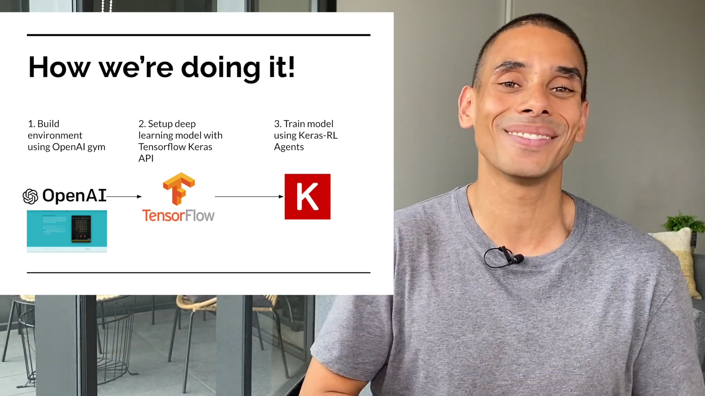

# **Deep Q-learning**

## **Learning Objectives**

* What is Deep Q-learning?
	* Q-learning + Deep Neural Network = Rather than using value iteration to directly compute q-values and find the optimal q-function, instead we use a function approximator to estimate the optimal q-function.


	
* What is the policy network?
	* max term!
* What is replay memory?
	* We store the agent's experiences at each time step in a data set called the *replay memory*.
	This *replay memory* data set is what we'll randomly sample from to train the network. The act of gaining experience and sampling from the replay memory that stores these experience is called *experience replay*.
* What is the target network?
	* The target network is a clone of the policy network. Its weights are frozen with the original policy network's weights, and we update the weights in the target network to the policy network's new weights every certain amount of time steps.
* Why must we utilize two separate networks during training?
* What is keras-rl? How do you use it?
	* keras-rl implements some state-of-the art deep reinforcement learning algorithms in Python and seamlessly integrates with the deep learning library Keras.


	

### **Installing Keras-RL**

```
pip install --user keras-rl
```

### **Dependencies**
```
pip install --user keras==2.2.4
pip install gym[atari]
pip install --user Pillow
pip install --user h5py
```

TRAIN: utilizes keras, keras-rl, and gym to train an agent that can play Atari’s Breakout:

### **Note!**
* Your script should utilize keras-rl‘s DQNAgent, SequentialMemory, and EpsGreedyQPolicy
* Your script should save the final policy network as policy.h5


### **Tutorials**

* [Deep Reinforcement Learning for Atari Games Python Tutorial | AI Plays Space Invaders](https://www.youtube.com/watch?v=hCeJeq8U0lo)

* [Playing Atari Breakout with Deep Reinforcement Learning](https://www.youtube.com/watch?v=cNkxCQflixY)

### **Resources**

* [Replay Memory Explained - Experience for Deep Q-Network Training](https://deeplizard.com/learn/video/Bcuj2fTH4_4)
* [Training a Deep Q-Network - Reinforcement Learning](https://deeplizard.com/learn/video/0bt0SjbS3xc)
* [Training a Deep Q-Network with Fixed Q-targets - Reinforcement Learning](https://deeplizard.com/learn/video/xVkPh9E9GfE)
1. Initialize replay memory capacity.
2. Initialize the network with random weights.
3. Clone the policy network, and call it the target network.
4. For each episode:
	1. Initialize the starting state.
	2. For each time step:
		1. Select an action.
			* Via exploration or exploitation
		2. Execute selected action in an emulator.
		3. Observe reward and next state.
		4. Store experience in replay memory.
		5. Sample random batch from replay memory.
		6. Preprocess states from batch.
		7. Pass batch of preprocessed states to policy network.
		8. Calculate loss between output Q-values and target Q-values.
			* Requires a second pass to the network for the next state
		9. Gradient descent updates weights in the policy network to minimize loss.
			* After `x` time steps, weights in the target network are updated to the weights in the policy network.