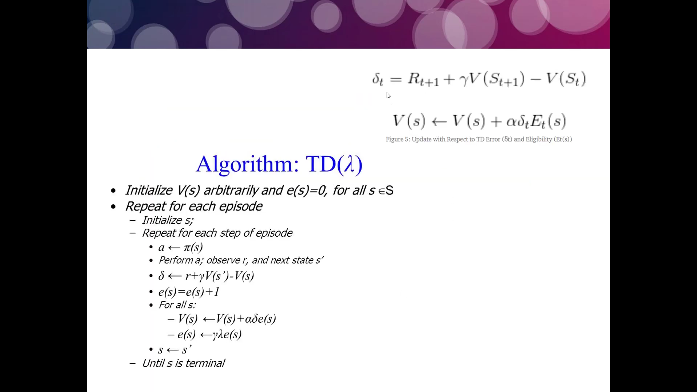

# **Temporal Difference**

## **Learning Objectives**

* What is Monte Carlo?
	* Monte Carlo methods, or Monte Carlo experiments, are a broad class of computational algorithms that rely on repeated random sampling to obtain numerical results
* What is Temporal Difference?
	* Temporal difference learning refers to a class of model-free reinforcement learning methods which learn by bootstrapping from the current estimate of the value function.
	* Temporal difference is an agent learning from an environment through episodes with no prior knowledge of the environment.
* What is bootstrapping?
	* Method to estimate the remaining return for the episode. Basically put, it is making a guess of the value function, taking some steps, and then making another guess, updating our original guess towards this new one.
* What is n-step temporal difference?
* What is TD(λ)?
	* TD-Lambda is a learning algorithm invented by Richard S. Sutton based on earlier work on temporal difference learning by Arthur Samuel. - [More details](https://towardsdatascience.com/reinforcement-learning-td-%CE%BB-introduction-686a5e4f4e60)
* What is an eligibility trace?
	* An eligibility trace is a temporary record of the occurrence of an event, such as the visiting of a state or the taking of an action (backward view). The trace marks the memory parameters associated with the event as eligible for undergoing learning changes.
	* Eligibility traces is a way of weighting between temporal-difference “targets” and Monte-Carlo “returns”. Meaning that instead of using the one-step TD target, we use TD(λ) target. In other words it fine tunes the target to have a better learning performance.
* What is SARSA? SARSA(λ)? SARSAMAX?
* What is ‘on-policy’ vs ‘off-policy’?
	* On-policy methods attempt to evaluate or improve the policy that is used to make decisions. In contrast, off-policy methods evaluate or improve a policy different from that used to generate the data.

# **University College London Course on RL by David Silver**

Website: [www.davidsilver.uk](https://www.davidsilver.uk/teaching/)
## **Monte Carlo Algorithm  by David Silver**

## **Temporal-difference Algorithm  by David Silver**

## **Monte Carlo and Temporal-difference**

## **Backward TD(lambda)  by David Silver**

## **SARSA**

## **Note**
We use Lambda to robust the choice of N which avarage over many different Ns get the best of all possible N (the n-step algorithm!).
# **Resources**

* [Simple Reinforcement Learning: Temporal Difference Learning](https://medium.com/@violante.andre/simple-reinforcement-learning-temporal-difference-learning-e883ea0d65b0)
* [DeepMind x UCL | Introduction to Reinforcement Learning 2015 | RL Course by David Silver](https://www.youtube.com/playlist?list=PLqYmG7hTraZDM-OYHWgPebj2MfCFzFObQ)
* [Eligibility Traces in Reinforcement Learning](https://towardsdatascience.com/eligibility-traces-in-reinforcement-learning-a6b458c019d6)
* [RL Course by David Silver - Lecture 4: Model-Free Prediction](https://www.youtube.com/watch?v=PnHCvfgC_ZA)
* [RL Course by David Silver - Lecture 5: Model Free Control](https://www.youtube.com/watch?v=0g4j2k_Ggc4)
* [RL book](http://incompleteideas.net/book/the-book-2nd.html?source=post_page---------------------------)
# **More Algorithms**

## **First visit MC**
Check Algorithm used in file [0-monte_carlo.py](./0-monte_carlo.py)

## **TD(lambda)**

Check Algorithm used in file [1-td_lambtha.py](./1-td_lambtha.py)

***Holberton School repository projects - Machine learning Specialization***

*Project-based learning for Machine learning*
