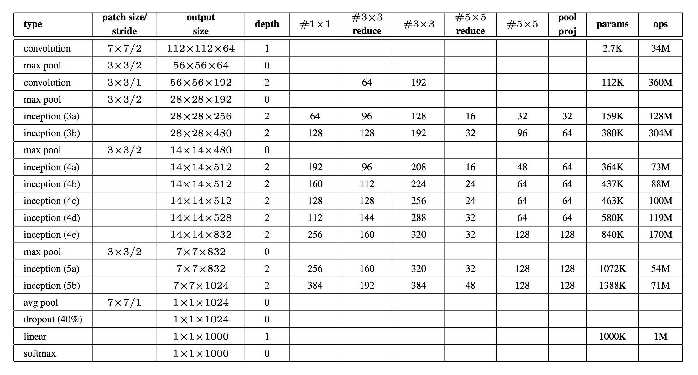

# **Deep Convolutional Architectures**

In this project we went throught diffrent architectures of the `deep convolutional neural network `for *Image Recongnition*

* Inception Network
* ResNet-50
* DenseNet-121

### Learning Objectives

* What is a skip connection?
* What is a bottleneck layer?
* What is the Inception Network?
* What is ResNet? ResNeXt? DenseNet?
* How to replicate a network architecture by reading a journal article?

### **Inception Network**
* Inception Block

* Architecture - Table

### **ResNet**
* Identity Block (Skip Connection)

* Projection Block

* Architecture - Table

### **DenseNet**
* Dense Block

* The bottleneck layers

* Architecture - Table

***Holberton School project - Machine learning Specialization***