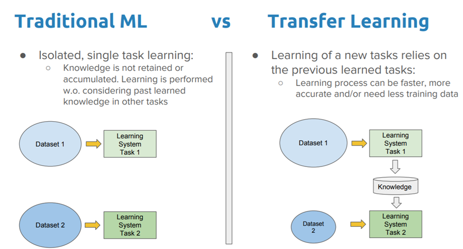

# Transfer Learning using InceptionV3 Keras application for CIFAR-10 Photo Classification

Building models from scratch to complete already solved tasks won’t save you time and resources. Transfer learning technique is a much better way!

### **Introduction**

Transfer Learning is another concept in machine learning. It is when we build a learning model based on previous knowledge (we implement already trained models — knowledge = weights and biases)



### **Dataset: CIFAR-10**

The CIFAR-10 data-set consists of 60000 32x32 color images in 10 classes, with 6000 images per class. There are 50000 training images and 10000 test images:
* five training batches (10000 images)
* one test batch (10000 images)


### **InceptionV3 Keras Application**

Keras Applications are deep learning models that are made available alongside pre-trained weights. These models can be used for prediction, feature extraction, and fine-tuning.

My final model was constructed using thelinceptionV3 model.
```
tf.keras.applications.InceptionV3(
    include_top=True,
    weights="imagenet",
    input_tensor=None,
    input_shape=None,
    pooling=None,
    classes=1000,
    classifier_activation="softmax",
)
```

### **Fine Tuning**

After traing the models with unfreezed layers
I have use a technique called fine tuning and unfreeze only some layers in the base_inception model

### More experiments

* Use callbacks. Keras early stopping of training via a callback called EarlyStopping.
* Add more epoches.

### **Final results**
```
Epoch 1/10
167/167 [==============================] - 200s 1s/step - loss: 0.3344 - accuracy: 0.8852 - val_loss: 0.3620 - val_accuracy: 0.8768
Epoch 2/10
167/167 [==============================] - 202s 1s/step - loss: 0.3217 - accuracy: 0.8908 - val_loss: 0.3598 - val_accuracy: 0.8768
Epoch 2: early stopping
```

#### Read or watch:

* [A Comprehensive Hands-on Guide to Transfer Learning with Real-World Applications in Deep Learning](https://towardsdatascience.com/a-comprehensive-hands-on-guide-to-transfer-learning-with-real-world-applications-in-deep-learning-212bf3b2f27a?gi=e3f1e4f633ba)
* [Transfer Learning](https://www.youtube.com/watch?v=FQM13HkEfBk&index=20&list=PLkDaE6sCZn6Gl29AoE31iwdVwSG-KnDzF)
* [Transfer learning & fine-tuning](https://www.tensorflow.org/guide/keras/transfer_learning/)

#### Definitions to skim:

* [Transfer learning](https://en.wikipedia.org/wiki/Transfer_learning)

#### References:

* [Keras Applications](https://keras.io/api/applications/)
* [Keras Datasets](https://www.tensorflow.org/api_docs/python/tf/keras/datasets/)
* [tf.keras.layers.Lambda](https://www.tensorflow.org/api_docs/python/tf/keras/layers/Lambda)
* [tf.image.resize](https://www.tensorflow.org/api_docs/python/tf/image/resize)
* [A Survey on Deep Transfer Learning](https://intranet.hbtn.io/rltoken/094hW_tsJrotSljWeiCSSA)