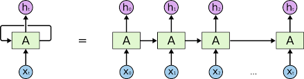
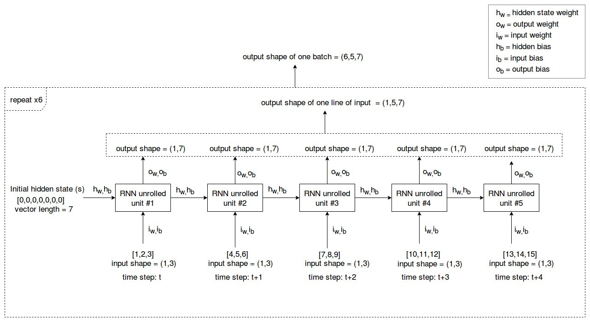
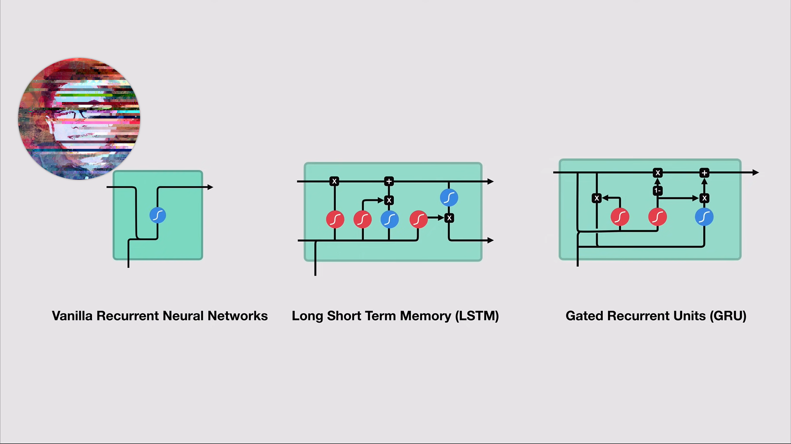
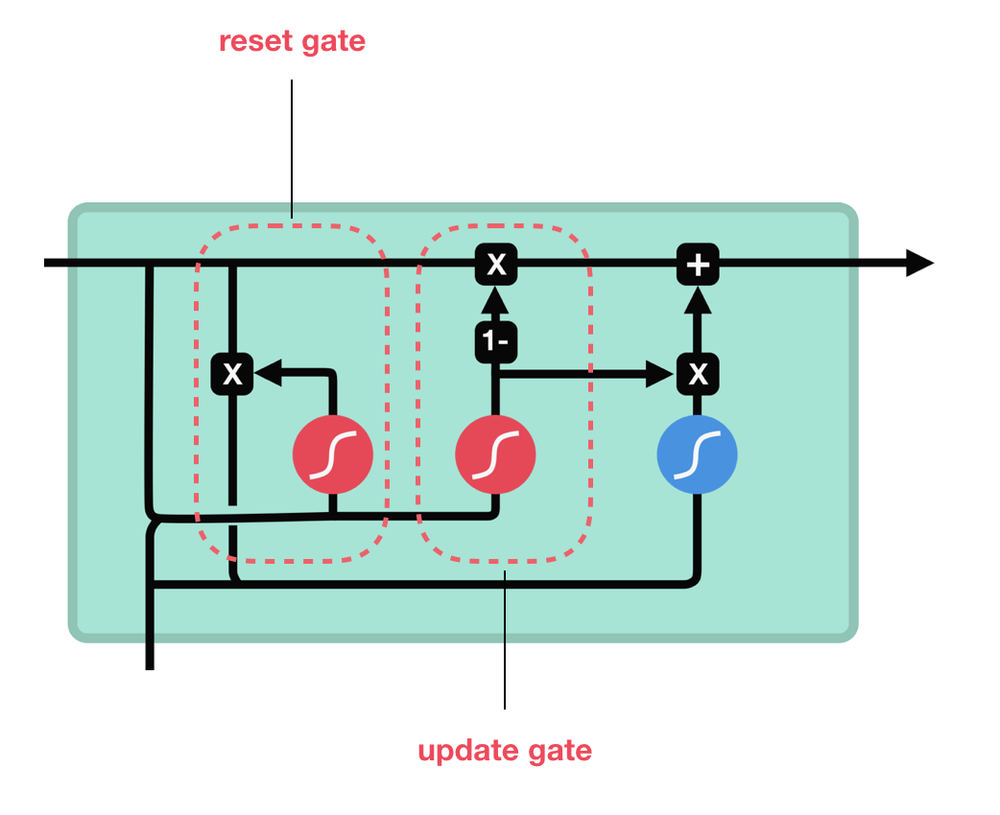

# **RNNs - Recurrent Neural Networks**

RNNs have a very unique architecture that helps them to model memory units (hidden state) that enable them to persist data, thus being able to model short term dependencies.

## **RNN Architectures**

**Example and key concept of how RNNs works:**

Taking, batch size is 6, RNN size is 7, the number of time steps/segments you would include in one input line is 5 and the number of features in one time step is 3.

more details in this blog! [All you need to know about RNNs](https://towardsdatascience.com/all-you-need-to-know-about-rnns-e514f0b00c7c)

**More RNN Architectures**

more details watch this video! [Illustrated Guide to LSTM's and GRU's: A step by step explanation](https://www.youtube.com/watch?v=8HyCNIVRbSU)

**Detailes on the Gated Recurrent Unit - GRU**

**GRU Gates**

## **Resources**

* [Recurrent Neural Networks : Introduction for Beginners](https://www.analyticsvidhya.com/blog/2021/06/recurrent-neural-networks-introduction-for-beginners/)
	* what is RNN?

    * Forward propagation in RNN

    * Backward propagation in RNN

    * Types of RNN architectures

    * Applications of RNN

* [Understanding LSTM Networks](http://colah.github.io/posts/2015-08-Understanding-LSTMs/)
	* how it works step by steb with functions used!
