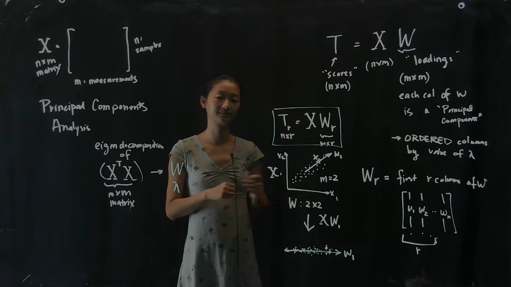
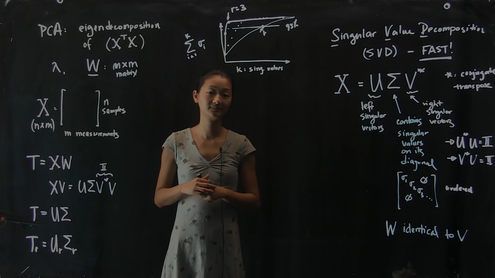

# **Dimensionality Reduction**

Compress features, reduce overfitting and noise and increase eficciency and performance.

### **Learning Objectives**

* What is eigendecomposition?
* What is singular value decomposition?
* What is the difference between eig and svd?
* What is dimensionality reduction and what are its purposes?
* What is principal components analysis (PCA)?
* What is t-distributed stochastic neighbor embedding (t-SNE)?
* What is a manifold?
* What is the difference between linear and non-linear dimensionality reduction?
* Which techniques are linear/non-linear?

### **Resources**

* [Dimensionality Reduction: Principal Components Analysis, Part 1 | Data4Bio](https://www.youtube.com/watch?v=ZqXnPcyIAL8)

* [Dimensionality Reduction: Principal Components Analysis, Part 2 | Data4Bio](https://www.youtube.com/watch?v=NUn6WeFM5cM)

## **PCA: Principal Component Analysis**

PCA is a method for compressing a lot of data into something that captures the essence of the original data.

* [Principal Component Analysis (PCA) clearly explained (2015)](https://www.youtube.com/watch?v=_UVHneBUBW0)

## **t-SNE: t-distributed Stochastic Neighborhood Embedding**

t-SND is a dimention reduction/ data visualisation method!

[How to Use t-SNE Effectively](https://distill.pub/2016/misread-tsne/)

[t-SNE clearly explained](https://towardsdatascience.com/t-sne-clearly-explained-d84c537f53a)
