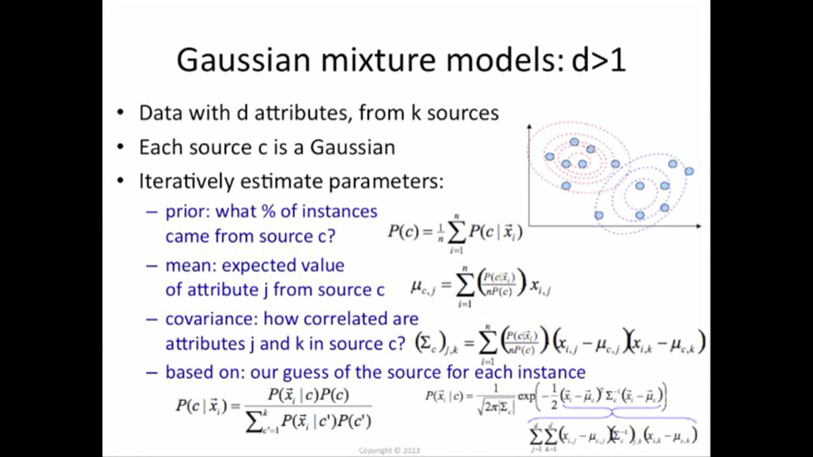
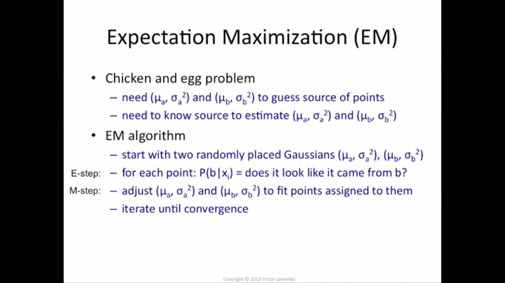

# **Clustering**

### **Learning Objectives**


* What is a multimodal distribution?
* What is a cluster?
* What is cluster analysis?
* What is “soft” vs “hard” clustering?
* What is K-means clustering?
* What are mixture models?
* What is a Gaussian Mixture Model (GMM)?
* What is the Expectation-Maximization (EM) algorithm?
* How to implement the EM algorithm for GMMs
* What is cluster variance?
* What is the mountain/elbow method?
* What is the Bayesian Information Criterion?
* How to determine the correct number of clusters
* What is Hierarchical clustering?
* What is Agglomerative clustering?
* What is Ward’s method?
* What is Cophenetic distance?
* What is `scikit-learn`?
* What is `scipy`?


## **K-means Clustering in Machine Learning**

A cluster refers to a collection of data points aggregated together because of certain similarities.


You’ll define a target number k, which refers to the number of centroids you need in the dataset. A centroid is the imaginary or real location representing the center of the cluster.


Every data point is allocated to each of the clusters through reducing the in-cluster sum of squares.


In other words, the K-means algorithm identifies k number of centroids, and then allocates every data point to the nearest cluster, while keeping the centroids as small as possible.

The ‘means’ in the K-means refers to averaging of the data; that is, finding the centroid.

[more details](https://towardsdatascience.com/understanding-k-means-clustering-in-machine-learning-6a6e67336aa1).

## **Gaussian Mixture Model**

Gaussian mixture models are a probabilistic model for representing normally distributed subpopulations within an overall population. Mixture models in general don't require knowing which subpopulation a data point belongs to, allowing the model to learn the subpopulations automatically. Since subpopulation assignment is not known, this constitutes a form of unsupervised learning. - [Gaussian Mixture Model](https://brilliant.org/wiki/gaussian-mixture-model/)

### **GMM - D>1**


### **EM**


### **Installing Scikit-Learn 0.22.x**

```
pip install --user scikit-learn==0.22
```
```


## **Resources**

### **Definitions to skim:**
* [Cluster analysis](https://en.wikipedia.org/wiki/Cluster_analysis)

* [K-means clustering](https://en.wikipedia.org/wiki/K-means_clustering#Algorithms)

* [Hierarchical clustering](https://en.wikipedia.org/wiki/Hierarchical_clustering)

