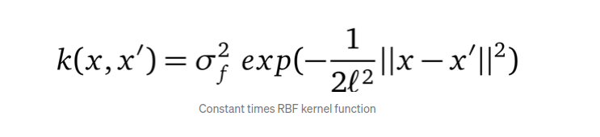
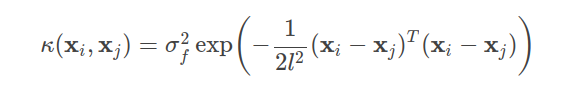
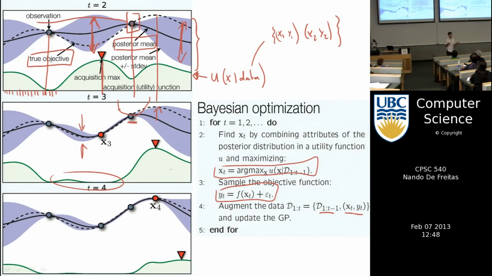
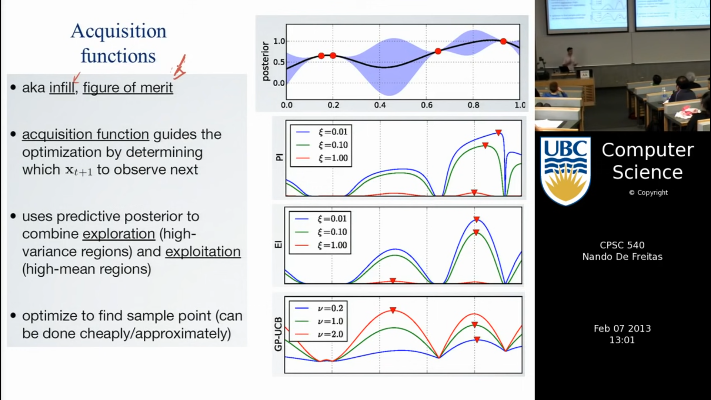

# **Hyperparameter Tuning**

## **Learning Objectives**

* What is Hyperparameter Tuning?

	* In machine learning, hyperparameter optimization or tuning is the problem of choosing a set of optimal hyperparameters for a learning algorithm. A hyperparameter is a parameter whose value is used to control the learning process. By contrast, the values of other parameters are learned.

* What is random search? grid search?

	* Random search is a family of numerical optimization methods that do not require the gradient of the problem to be optimized, and RS can hence be used on functions that are not continuous or differentiable. Such optimization methods are also known as direct-search, derivative-free, or black-box methods.

	* GridSearch is a tool that is used for hyperparameter tuning.
	* Grid-search is used to find the optimal hyperparameters of a model which results in the most 'accurate' predictions.

* What is a Gaussian Process?

	* In probability theory and statistics, a Gaussian process is a stochastic process, such that every finite collection of those random variables has a multivariate normal distribution, i.e. every finite linear combination of them is normally distributed.
	* An example of non-parametric methods are Gaussian processes (GPs). Instead of inferring a distribution over the parameters of a parametric function Gaussian processes can be used to infer a distribution over functions directly

* What is a mean function?

	* function that is commonly used to summarize random processes. [Mean Function](https://dlsun.github.io/probability/mean-function.html)

* What is a Kernel function?

	* In machine learning, kernel machines are a class of algorithms for pattern analysis, whose best known member is the support-vector machine. The general task of pattern analysis is to find and study general types of relations in datasets.
	* A positive definite kernel function or covariance function.
	* Thus, a Gaussian process is a distribution over functions whose shape (smoothness, …) is defined by K : `Kernel`

A `popular kernel` is the composition of the constant kernel with the `radial basis function (RBF) kernel`, which encodes for smoothness of functions (i.e. similarity of inputs in space corresponds to the similarity of outputs):

Numpy implementation:

* What is Gaussian Process Regression/Kriging?

	* In statistics, originally in geostatistics, kriging or Kriging, also known as Gaussian process regression, is a method of interpolation based on Gaussian process governed by prior covariances. Under suitable assumptions of the prior, kriging gives the best linear unbiased prediction at unsampled locations.

* What is Bayesian Optimization?

	* Bayesian optimization is a sequential design strategy for global optimization of black-box functions that does not assume any functional forms. It is usually employed to optimize expensive-to-evaluate functions.

	* Bayesian optimization incorporates prior belief about f and updates the prior with samples drawn from f to get a posterior that better approximates f. The model used for approximating the objective function is called surrogate model. Bayesian optimization also uses an acquisition function that directs sampling to areas where an improvement over the current best observation is likely.

	* Finally, Bayesian optimization is used to tune the hyperparameters of a tree-based regression model.

* What is an Acquisition function?

	* Acquisition functions are mathematical techniques that guide how the parameter space should be explored during Bayesian optimization. They use the predicted mean and predicted variance generated by the Gaussian process model.
	* Popular acquisition functions are maximum probability of improvement (MPI), expected improvement (EI) and upper confidence bound (UCB

* What is Expected Improvement?

	* The expected improvement (EI) algorithm is a popular strategy for information collection in optimization under uncertainty. The algorithm is widely known to be too greedy, but nevertheless enjoys wide use due to its simplicity and ability to handle uncertainty and noise in a coherent decision theoretic framework.

* What is Knowledge Gradient?

	* In statistics The optimistic knowledge gradient is a approximation policy proposed by Xi Chen, Qihang Lin and Dengyong Zhou in 2013.

* What is Entropy Search/Predictive Entropy Search?

	* In Bayesian optimization, a popular acquisition function is predictive entropy search, which is a clever reframing of another acquisition function, entropy search.

* What is GPy?

	* GPy is a Gaussian Process (GP) framework written in python, from the Sheffield machine learning group. Gaussian processes underpin range of modern machine learning algorithms. In GPy, we've used python to implement a range of machine learning algorithms based on GPs. GPy is available under the BSD 3-clause license.

* What is GPyOpt?
	* GPyOpt is a Python open-source library for Bayesian Optimization developed by the Machine Learning group of the University of Sheffield. It is based on GPy, a Python framework for Gaussian process modelling. With GPyOpt you can: Automatically configure your models and Machine Learning algorithms.

## **Orthogonalization**

**What is Orthogonalization in deep learning?**

* Orthogonalization is a system design property that ensures that modification of an instruction or an algorithm component does not create or propagate side effects to other system components.

## **Resources**

* [A Visual Exploration of Gaussian Processes](https://distill.pub/2019/visual-exploration-gaussian-processes/)

* [Gaussian processes](http://krasserm.github.io/2018/03/19/gaussian-processes/)

* [Quick Start to Gaussian Process Regression](https://towardsdatascience.com/quick-start-to-gaussian-process-regression-36d838810319)

**Gaussian Process Lectures**

* [Machine learning - Introduction to Gaussian processes](https://intranet.hbtn.io/rltoken/k6HZ2Sg5pRuXPE05wmarfA)

***Holberton School repository projects - Machine learning Specialization***